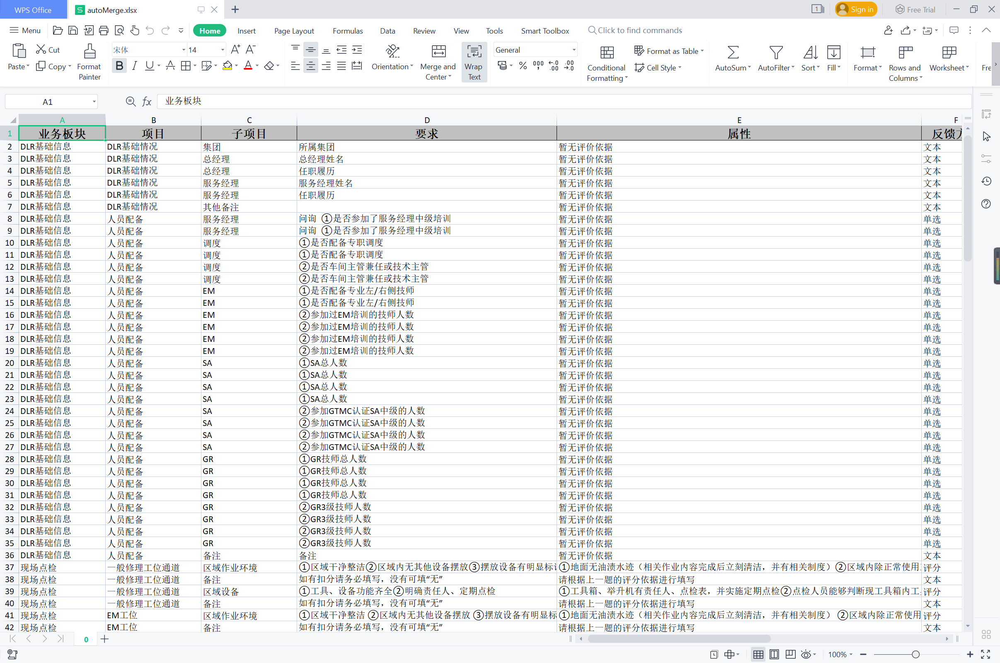
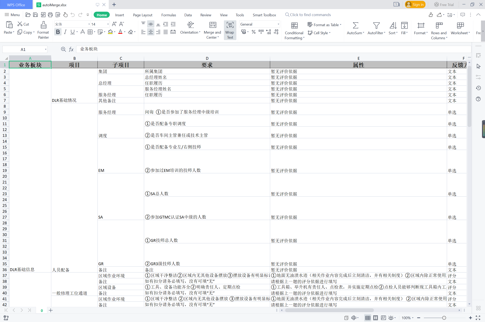

# EasyExcelExtensionsUtils
自己写或收集到的EasyExcel的导出处理器或导入监听器
## [ExcelFileCellMergeStrategy](src%2Fmain%2Fjava%2Fpers%2Frike%2Feasyexcel%2Fwritehandler%2FExcelFileCellMergeStrategy.java)
用来处理自动向上合并的策略类 

使用前

使用后

